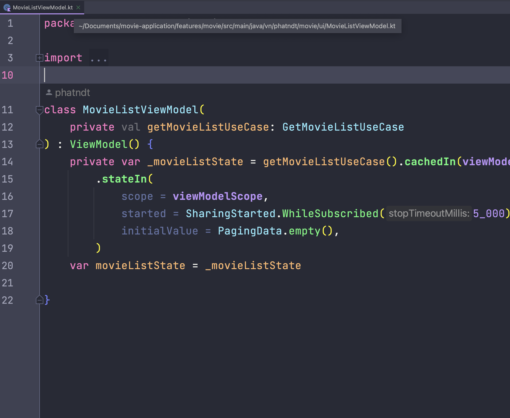
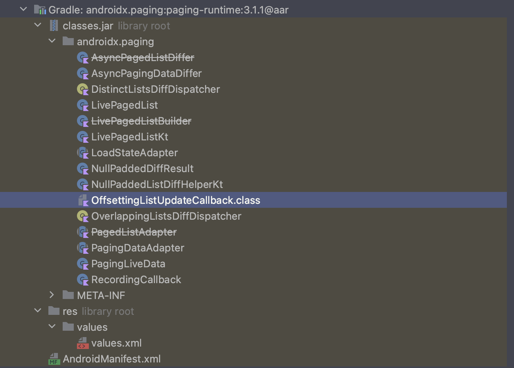

# Structure
## 1 Data: include MoviePagingSource class - PagingSource, LoadResult, LoadParams; MovieRepository class - Pager, PagingData

  
  

## 2 Domain: include GetMovieListUseCase class - Pager, PagingData

  
  

## 2 Presentation:

  

# Paging 3 libs:

  
  
  

## 1 Paging common

  
  
  

# [https://stackoverflow.com/questions/66262187/jetpack-paging-3-inside-java-kotlin-module/66271127#66271127](https://stackoverflow.com/questions/66262187/jetpack-paging-3-inside-java-kotlin-module/66271127#66271127)

